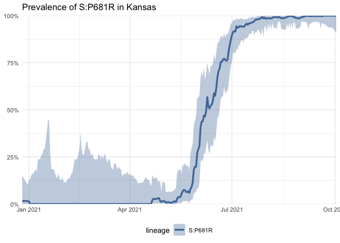
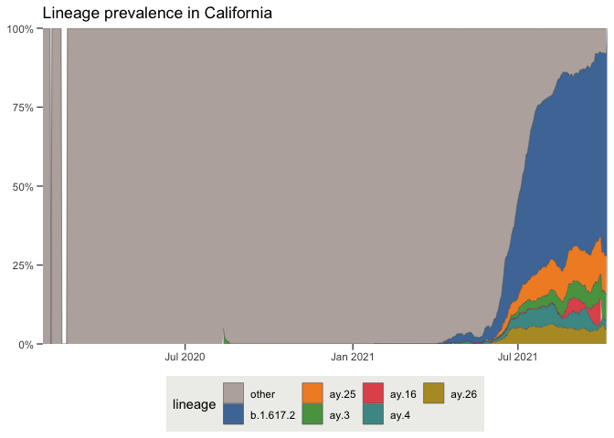
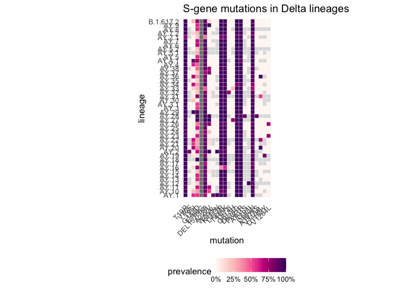
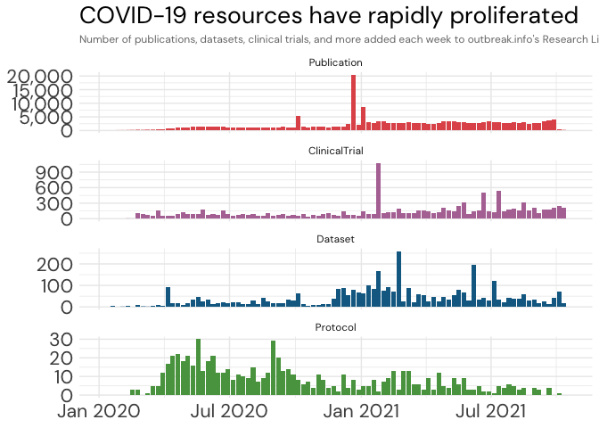
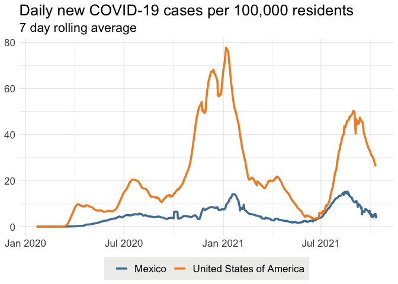

<!-- README.md is generated from README.Rmd. Please edit that file -->

# outbreakinfo 

#### R package for [outbreak.info](https://outbreak.info)

[outbreak.info](https://outbreak.info) is a platform to discover and
explore COVID-19 data and variants. Our [Variant
Reports](https://outbreak.info/situation-reports) allow researchers to
track any emerging or known variant using customizable visualizations,
enabling near real-time genomic surveillance. Our [Epidemiology
tools](https://outbreak.info/epidemiology) allow users to explore how
COVID-19 cases and deaths are changing across locations.

The **outbreakinfo** R package provides access to the underlying genomic
and epidemiology data on outbreak.info. This includes **SARS-CoV-2
variant prevalence** data calculated using the
[Bjorn](https://github.com/andersen-lab/bjorn/) package using data
provided by [GISAID](gisaid.org). We standardize **COVID-19 case and
death data** from [Johns Hopkins
University](https://github.com/CSSEGISandData/COVID-19) and the [New
York Times](https://github.com/nytimes/covid-19-data) and calculate
derived statistics.

## Installation

``` r
# Install development version from GitHub
devtools::install_github("outbreak-info/R-outbreak-info")
```

## Getting Started

If you’re getting started using **outbreakinfo**, we recommend starting
with our tutorial
[vignettes](https://outbreak-info.github.io/R-outbreak-info/docs/articles/index.html).

To access the genomic data (SARS-CoV-2 variant prevalences), you will
need to **create an account on
[GISAID](https://www.gisaid.org/registration/register/)** before being
able to access the data. *It may take a few days for the registration to
become active*. Before calling the genomics functions, you’ll need to
register your GISAID credentials:

``` r
outbreakinfo::authenticateUser()
```

Please view our
[vignettes](https://outbreak-info.github.io/R-outbreak-info/docs/articles/index.html)
for examples of how to use the R package.

## Related Projects

API access for outbreak.info’s [Research
Library](https://outbreak.info/resources), which provides metadata on
COVID-19 publications, pre-prints, clinical trials, datasets, protocols,
and more is available on our
[API](https://api.outbreak.info/try/resources). API access for the cases
and deaths data is also available on our
[API](https://api.outbreak.info/try/covid19). In addition to this R
package, the Research Library and Cases & Deaths API endpoints can be
accessed through the [httr](https://httr.r-lib.org/) R package or the
the Python [requests](https://docs.python-requests.org/en/latest/)
package.

-----

## Examples

### Genomic data

#### Lineage | Mutation Tracker

Provides access to the prevalence of a lineage, mutation(s), or lineage
with additional mutations, to access the data underlying the
[outbreak.info Variant Tracker](https://outbreak.info/situation-reports)
- in this example, mutation \[S:P681R\]
(<https://outbreak.info/situation-reports?muts=S%3AP681R>). View the
[Variant Tracker Vignette](articles/varianttracker.html) to explore more
options.

``` r
library(outbreakinfo)
#  Provide GISAID credentials using authenticateUser()
# Get the prevalence of mutation P681R in the Spike protein in Kansas over time.
P681R = getPrevalence(mutations = c("S:P681R"), location = "Kansas", logInfo = FALSE)
plotPrevalenceOverTime(P681R, title = "Prevalence of S:P681R in Kansas")
```

<!-- -->

#### Location Tracker

Provides access to the prevalence of all lineages and variants in a
country, state/province, or U.S. county, to access the data underlying
the [outbreak.info Location
Tracker](https://outbreak.info/location-reports?loc=USA_US-CA). View the
[Location Tracker Vignette](articles/locationtracker.html) to explore
more options.

``` r
library(outbreakinfo)
#  Provide GISAID credentials using authenticateUser()
# Get the prevalence of all circulating lineages in California over the past 90 days
ca_lineages = getAllLineagesByLocation(location = "California", ndays = 90)
#> Retrieving data...

# Plot the prevalence of the dominant lineages in California
plotAllLineagesByLocation(location = "California", ndays = 90)
#> Retrieving data... 
#> Plotting data...
```

<!-- -->

#### Lineage Comparison Tool

Provides access to the mutations per lineage, to access the data
underlying the [outbreak.info Lineage Comparison
Tool](https://outbreak.info/compare-lineages?pango=P.1&gene=ORF1a&gene=ORF1b&gene=S&gene=E&gene=ORF3a&gene=M&gene=ORF10&gene=N&gene=ORF8&gene=ORF7b&gene=ORF7a&gene=ORF6&threshold=80&dark=true).

``` r
library(outbreakinfo)
#  Provide GISAID credentials using authenticateUser()

# Lookup which Pango lineages are associated with the Delta / B.1.617.2 Variant of Concern
delta_lineages = lookupSublineages("Delta", returnQueryString = FALSE)

# Get all mutations in the Delta lineages with at least 75% prevalent in one of the lineages.
delta_mutations = getMutationsByLineage(pangolin_lineage=delta_lineages, frequency=0.75, logInfo = FALSE)

# Plot the mutations as a heatmap
plotMutationHeatmap(delta_mutations, title = "S-gene mutations in Delta lineages")
```

<!-- -->

### Research Library

Provides access to the metadata on COVID-19 research, including
publications, clinical trials, datasets, protocols, and more.

``` r
library(outbreakinfo)
library(dplyr)
library(ggplot2)
library(lubridate)

resources_by_date = getResourcesData(query = "date:[2020-01-01 TO *]", types=c("Publication", "ClinicalTrial", "Protocol", "Dataset"), fields = c("date", "@type"), fetchAll = TRUE)

# roll up the number of resources by week
resources_by_date = resources_by_date %>% 
  mutate(year = lubridate::year(date),
         iso_week = lubridate::isoweek(date)) 

# count the number of new resources per week.
resources_per_week = resources_by_date %>% 
  count(`@type`, iso_week, year) %>% 
  # convert from iso week back to a date
  mutate(iso_date = lubridate::parse_date_time(paste(year,iso_week, "Mon", sep="-"), "Y-W-a")) 

# Make it a bit prettier, by sorting by the relative proportion of resource types
type_frequency = resources_by_date %>% 
count(`@type`) %>% 
  arrange(desc(n)) %>%
  pull(`@type`)

resources_per_week$`@type` = factor(resources_per_week$`@type`, type_frequency)

ggplot(resources_per_week, aes(x = iso_date, y = n, fill = `@type`)) +
  geom_bar(stat="identity") +
  ggtitle("COVID-19 resources have rapidly proliferated", subtitle="Number of publications, datasets, clinical trials, and more added each week to outbreak.info's Research Library") +
  theme_minimal() + 
  theme(
    text = element_text(family="DM Sans"),
    axis.title = element_blank(),
    axis.text = element_text(size = 16),
    plot.title = element_text(size = 20),
    plot.subtitle = element_text(colour="#777777", size=9)
  ) +
  scale_x_datetime(limits = c(min(resources_per_week$iso_date, na.rm = T), max(resources_per_week$iso_date, na.rm = T)), date_labels = "%b %Y") +
  scale_y_continuous(label=scales::comma) +
  scale_fill_manual(values = c(Publication = "#e15759", ClinicalTrial = "#b475a3", Dataset = "#126b93", Protocol = "#59a14f")) +
  facet_wrap(~`@type`, scales = "free_y", ncol = 1) +
  theme(legend.position = "none")
```

<!-- -->

### Cases & Deaths

Replicates the daily confirmed cases visualization on
[outbreak.info](https://outbreak.info/epidemiology) - in this example,
[the United States and
Mexico](https://outbreak.info/epidemiology?location=USA%3BMEX&log=false&variable=confirmed_rolling&xVariable=date&fixedY=false&percapita=true).

``` r
# Plots the daily confirmed cases per capita for the United States and Mexico.
library(outbreakinfo)
plotEpiData(locations = c("United States of America", "Mexico"), variable = "confirmed_rolling_per_100k")
```

<!-- -->

-----

## Data Sources

### SARS-CoV-2 virus sequences

We would like to thank the GISAID Initiative and are grateful to all of
the data contributors, i.e.the Authors, the Originating laboratories
responsible for obtaining the specimens, and the Submitting laboratories
for generating the genetic sequence and metadata and sharing via the
GISAID Initiative, on which this research is based. GISAID data provided
on this website are subject to GISAID’s [Terms and
Conditions](https://www.gisaid.org/registration/terms-of-use/).

The GISAID Initiative promotes the rapid sharing of data from all
influenza viruses and the coronavirus causing COVID-19. This includes
genetic sequence and related clinical and epidemiological data
associated with human viruses, and geographical as well as
species-specific data associated with avian and other animal viruses, to
help researchers understand how viruses evolve and spread during
epidemics and pandemics.

GISAID does so by overcoming disincentive hurdles and restrictions,
which discourage or prevented sharing of virological data prior to
formal publication.

The Initiative ensures that open access to data in GISAID is provided
free-of-charge to all individuals that agreed to identify themselves and
agreed to uphold the GISAID sharing mechanism governed through its
[Database Access
Agreement](https://www.gisaid.org/registration/terms-of-use/).

### Cases & deaths

Confirmed cases, recovered cases, and deaths over time for countries
outside the United States, and provinces in Australia, Canada, and China
are provided by [Johns Hopkins University Center for Systems Science and
Engineering](https://github.com/CSSEGISandData/COVID-19). See [data
FAQ](https://systems.jhu.edu/research/public-health/2019-ncov-map-faqs/).

Confirmed cases and deaths over time for the United States, U.S. States,
U.S. Metropolitan Areas, U.S. cities and U.S. counties are provided by
the [New York Times](https://github.com/nytimes/covid-19-data). Note
that “New York City” refers to the combined totals for New York, Kings,
Queens, Bronx and Richmond Counties; “Kansas City” refers to cases
within the Missouri portion of the Kansas City Metropolitan area and
values for Jackson, Cass, Clay, and Platte counties are the totals
excluding the KCMO data; cities like St. Louis that are administered
separately from their containing county are reported separately. See
other [geographic
exceptions](https://github.com/nytimes/covid-19-data#geographic-exceptions).
